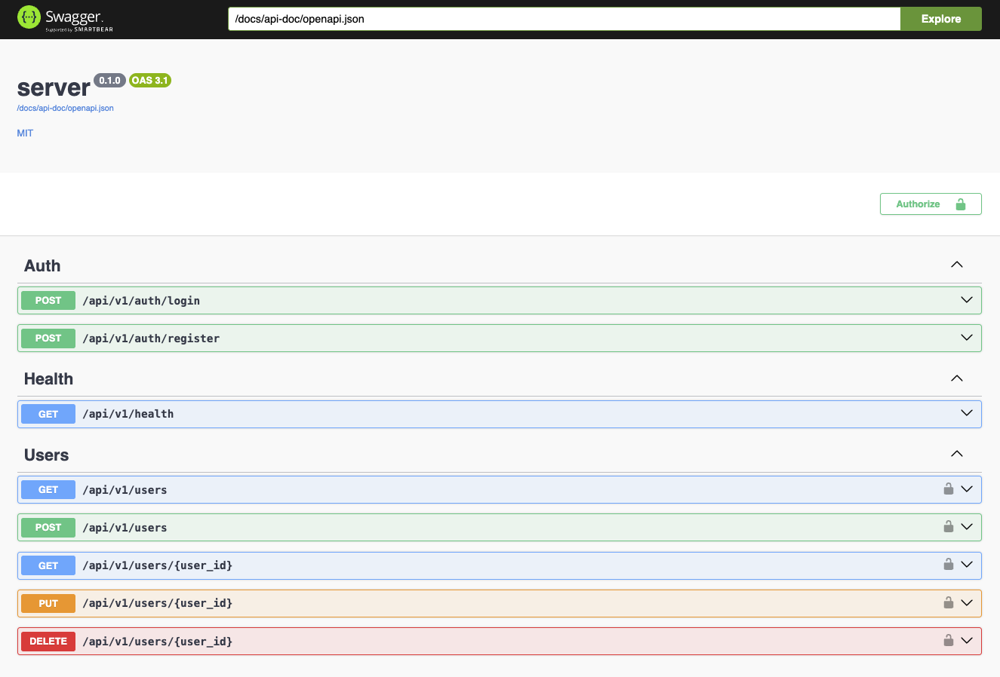
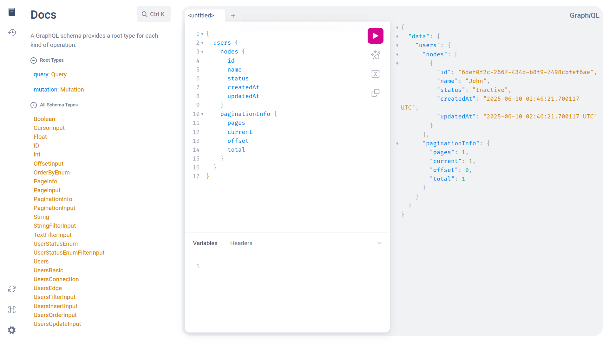
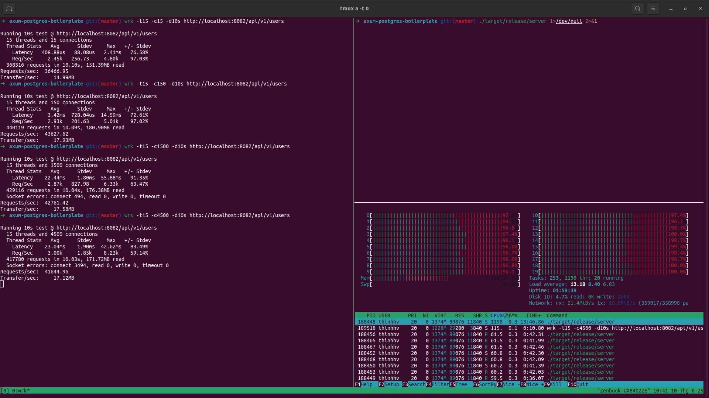

<h1 align="center">Rust Axum + SeaORM Boilerplate</h1>

<p align="center">
  <a href="https://www.rust-lang.org/"></a>
  <a href="https://github.com/tokio-rs/axum"></a>
  <a href="https://github.com/SeaQL/sea-orm"></a>
  <a href="LICENSE"></a>
  <a href="https://github.com/nakamuraos/rust-axum-seaorm-boilerplate/stargazers"></a>
  <a href="https://github.com/nakamuraos/rust-axum-seaorm-boilerplate/network/members"></a>
  <a href="https://github.com/nakamuraos/rust-axum-seaorm-boilerplate/issues"></a>
</p>

<p align="center">A production-ready REST + GraphQL API boilerplate built with <a href="https://github.com/tokio-rs/axum">Axum</a>, <a href="https://github.com/SeaQL/sea-orm">Sea-ORM</a>, and PostgreSQL.</p>





## Features

- **REST API** with versioned routes (`/api/v1/...`)
- **GraphQL** with [Seaography](https://github.com/SeaQL/seaography) + field-level guards
- **OpenAPI/Swagger** auto-generated docs via [utoipa](https://github.com/juhaku/utoipa)
- **JWT authentication** with bcrypt password hashing and rotating refresh tokens
- **Role-based access control** - Admin, User roles with auth/admin/owner guards
- **Sea-ORM** with auto-migrations and connection pooling
- **Pagination** - page-based and cursor-based
- **Request validation** - `ValidatedJson` / `ValidatedPath` extractors
- **Middleware** - CORS, request ID (UUID v7), timeout, tracing
- **Structured JSON logging** via [tracing](https://github.com/tokio-rs/tracing)
- **Docker** support with multi-stage builds

## Project Structure

```
src/
├── common/
│   ├── config/             # App configuration, telemetry, shutdown signal
│   ├── errors/             # Centralized error handling (ApiError)
│   ├── extractors/         # ValidatedJson, ValidatedPath extractors
│   ├── middlewares/        # CORS, timeout, request ID, normalize path, basic auth
│   ├── api_doc.rs          # OpenAPI/Swagger setup
│   ├── graphql.rs          # GraphQL schema & router
│   └── pagination.rs       # Page & cursor pagination
├── database/
│   ├── mod.rs              # Connection pool setup
│   ├── main.rs             # Standalone CLI for migrations & seeds
│   ├── migrations/         # Sea-ORM migrations
│   └── seeds/              # Database seed data
├── workers/
│   ├── mod.rs              # Job trait & runner
│   ├── main.rs             # Standalone CLI for background jobs
│   └── jobs/               # One module per job, listed in registry()
├── modules/
│   ├── auth/               # Login, register, JWT guards (auth/admin/owner)
│   ├── users/              # CRUD, entities, DTOs, role & status enums
│   └── health/             # Health check endpoint
├── app.rs                  # Router & middleware setup
├── lib.rs
└── main.rs
```

## API Endpoints

| Method     | Path                    | Auth        | Description                  |
| ---------- | ----------------------- | ----------- | ---------------------------- |
| `POST`     | `/api/v1/auth/register` | -           | Register, returns token pair |
| `POST`     | `/api/v1/auth/login`    | -           | Login, returns token pair    |
| `POST`     | `/api/v1/auth/refresh`  | -           | Rotate the refresh token     |
| `POST`     | `/api/v1/auth/logout`   | -           | Revoke one refresh token     |
| `POST`     | `/api/v1/auth/logout-all` | JWT       | Revoke all user sessions     |
| `GET`      | `/api/v1/auth/sessions` | JWT         | List logins of the caller    |
| `GET`      | `/api/v1/health`        | -           | Health check                 |
| `GET`      | `/api/v1/users`         | Admin       | List users (paginated)       |
| `POST`     | `/api/v1/users`         | Admin       | Create user                  |
| `GET`      | `/api/v1/users/:id`     | Owner/Admin | Get user                     |
| `PUT`      | `/api/v1/users/:id`     | Owner/Admin | Update user                  |
| `DELETE`   | `/api/v1/users/:id`     | Owner/Admin | Delete user                  |
| `GET/POST` | `/graphql`              | JWT         | GraphQL playground & queries |
| `GET`      | `/docs`                 | -           | Swagger UI                   |

## Getting Started

### Prerequisites

- Rust (latest stable)
- PostgreSQL (or Docker)

### 1. Clone & configure

<details open>
<summary>Option A: Using cargo-generate (recommended for new projects)</summary>

```shell
cargo install cargo-generate
cargo generate nakamuraos/rust-axum-seaorm-boilerplate
cd <your-project-name>
cp .env.sample .env
# Edit .env - at minimum set DATABASE_URL and JWT_SECRET
```

</details>

<details>
<summary>Option B: Manual clone</summary>

```shell
git clone https://github.com/nakamuraos/rust-axum-seaorm-boilerplate
cd rust-axum-seaorm-boilerplate
cp .env.sample .env
# Edit .env - at minimum set DATABASE_URL and JWT_SECRET
```

</details>

### 2. Start PostgreSQL

```shell
# Using Docker:
docker run -d -p 5432:5432 -e POSTGRES_PASSWORD=password postgres
```

### 3. Run

```shell
cargo run
```

The server starts at `http://localhost:8080`. Migrations and seeds run automatically in development.

- Swagger UI: `http://localhost:8080/docs`
- GraphQL: `http://localhost:8080/graphql`

GraphQL (Seaography) is enabled by the default `graphql` Cargo feature. For a REST-only build:

```shell
cargo run --no-default-features
```

### Migrations & Seeds

[Migrations](https://www.sea-ql.org/SeaORM/docs/migration/running-migration/) and [seeds](https://www.sea-ql.org/SeaORM/docs/migration/seeding-data/) are managed separately in `src/database/` and run programmatically on application startup. They run automatically in development (`APP_ENV=development`, `DATABASE_RUN_MIGRATIONS=true` and/or `DATABASE_RUN_SEEDS=false`) and are disabled by default in production.

You can also run them standalone without starting the server:

```shell
# Run all pending migrations
cargo run --bin db -- migrate
# Run all database seeds
cargo run --bin db -- seed
# Run migrations then seeds
cargo run --bin db -- setup
```

Seeds are idempotent - they check if each user already exists before inserting, so they are safe to run multiple times.

Default seed users:

| Email               | Password    | Role  |
| ------------------- | ----------- | ----- |
| `admin@example.com` | `Admin@123` | Admin |
| `user1@example.com` | `User@1234` | User  |
| `user2@example.com` | `User@1234` | User  |

### Background workers

Jobs that run outside the request path live in `src/workers/`. The `worker`
binary runs one job, or `all` of them, and exits - so it can be driven by cron
or a scheduler. Passing `--watch` keeps the process alive and repeats each job
on its own interval instead.

```shell
cargo run --bin worker -- --list           # show the available jobs
cargo run --bin worker -- cleanup-tokens   # run one job once
cargo run --bin worker -- all              # run every job once
cargo run --bin worker -- all --watch      # keep running on an interval
```

Adding a job means writing a module next to `src/workers/jobs/cleanup_tokens.rs`
and listing it in `registry()`:

```rust
pub struct MyJob;

#[async_trait::async_trait]
impl Job for MyJob {
  fn name(&self) -> &'static str { "my-job" }
  fn description(&self) -> &'static str { "What it does" }

  async fn run(&self, ctx: &JobContext) -> Result<u64, ApiError> {
    // ctx.db and ctx.cfg are available here
    Ok(0)
  }
}
```

The command line, the listing and watch mode pick it up from the registry. A job
runs on `workers.interval_hours` in watch mode unless it overrides `interval()`,
and a failed run is logged without taking the process down.

The bundled `cleanup-tokens` job deletes expired refresh tokens, and revoked ones
past `workers.token_retention_days`. Revoked tokens are kept for that window so a
rotated token resurfacing is still recognizable, and so recent logins stay
visible in `GET /api/v1/auth/sessions`.

### Auto-reload (development)

```shell
cargo install cargo-watch
cargo watch -q -x run
# or pipe to jq for formatted logs:
cargo watch -q -x run | jq .
```

### Format code

```shell
cargo fmt
```

Formats all Rust code in the project according to the official style guide.

### Lint code

```shell
cargo clippy
```

Runs the Clippy linter to catch common mistakes and suggest improvements.

### Run tests

```shell
cargo test
```

Executes all unit and integration tests.

## Docker Compose

```shell
cp .env.sample .env
docker-compose up    # or -d for detached
docker-compose down  # stop
```

## Configuration

Settings can come from three sources, listed from the highest precedence to the
lowest. The first source that provides a value wins, and anything left unset
falls back to the built-in default.

1. Command line arguments
2. Environment variables, loaded from `.env` in development
3. A YAML file, `config/config.yml` by default

Every key in the YAML file has an environment variable derived from its dotted
path: uppercased, with `.` replaced by `_`. So `database.url` is overridden by
`DATABASE_URL` and `swagger.basic_auth` by `SWAGGER_BASIC_AUTH`. Adding a key to
the file therefore adds its variable too, without any extra wiring.

```shell
cp config/config.example.yml config/config.yml
cp .env.sample .env

# Use a different YAML file
./target/release/server --config /etc/app/config.yml
CONFIG=/etc/app/config.yml ./target/release/server

# Override a single setting
./target/release/server --port 9000 --database-run-migrations true
```

Keys in the file that the application does not recognize are logged as a warning
on startup, which catches typos.

| Argument                    | YAML key                  | Variable                  | Default             | Description                      |
| --------------------------- | ------------------------- | ------------------------- | ------------------- | -------------------------------- |
| `--env`                     | `env`                     | `ENV`, `APP_ENV`          | `development`       | `development` or `production`    |
| `--port`                    | `serve.port`              | `SERVE_PORT`, `PORT`      | `8080`              | Server port                      |
| `--database-url`            | `database.url`            | `DATABASE_URL`            | -                   | PostgreSQL connection string     |
| `--database-pool-max-size`  | `database.pool_max_size`  | `DATABASE_POOL_MAX_SIZE`  | `10`                | Max DB connections               |
| `--database-timeout`        | `database.timeout`        | `DATABASE_TIMEOUT`        | `5`                 | Connection timeout (seconds)     |
| `--database-run-migrations` | `database.run_migrations` | `DATABASE_RUN_MIGRATIONS` | dev only            | Auto-run migrations on startup   |
| `--database-run-seeds`      | `database.run_seeds`      | `DATABASE_RUN_SEEDS`      | dev only            | Auto-run seeds on startup        |
| `--jwt-secret`              | `jwt.secret`              | `JWT_SECRET`              | -                   | JWT signing key                  |
| `--jwt-expiration-days`     | `jwt.expiration_days`     | `JWT_EXPIRATION_DAYS`     | `7`                 | Access token lifetime            |
| `--jwt-refresh-expiration-days` | `jwt.refresh_expiration_days` | `JWT_REFRESH_EXPIRATION_DAYS` | `30`      | Refresh token lifetime           |
| `--bcrypt-cost`             | `bcrypt.cost`             | `BCRYPT_COST`             | `12`                | Password hashing cost (4-31)     |
| `--token-retention-days`    | `workers.token_retention_days` | `WORKERS_TOKEN_RETENTION_DAYS` | `7`   | Days a revoked token is kept     |
| `--workers-interval-hours`  | `workers.interval_hours`  | `WORKERS_INTERVAL_HOURS`  | `24`                | Default job interval in watch mode |
| `--swagger-endpoint`        | `swagger.endpoint`        | `SWAGGER_ENDPOINT`        | `/docs`             | Swagger UI path                  |
| `--swagger-basic-auth`      | `swagger.basic_auth`      | `SWAGGER_BASIC_AUTH`      | -                   | Optional `user:pass` for Swagger |
| `--graphql-endpoint`        | `graphql.endpoint`        | `GRAPHQL_ENDPOINT`        | `/graphql`          | GraphQL path                     |
| `--graphql-basic-auth`      | `graphql.basic_auth`      | `GRAPHQL_BASIC_AUTH`      | -                   | Optional `user:pass` for GraphQL |
| `--config`                  | -                         | `CONFIG`                  | `config/config.yml` | Path to the YAML file            |
| -                           | -                         | `RUST_LOG`                | `debug`             | Log level filter                 |

## Production

```shell
# Binary
cargo build --release
# The optimized binary will be available at `target/release/server`
./target/release/server

# Docker
docker build -t axum-app .
docker run -d -p 8080:8080 -v $(pwd)/.env:/app/.env axum-app
```

## Contributing

Contributions are welcome! Feel free to open issues or submit pull requests.
